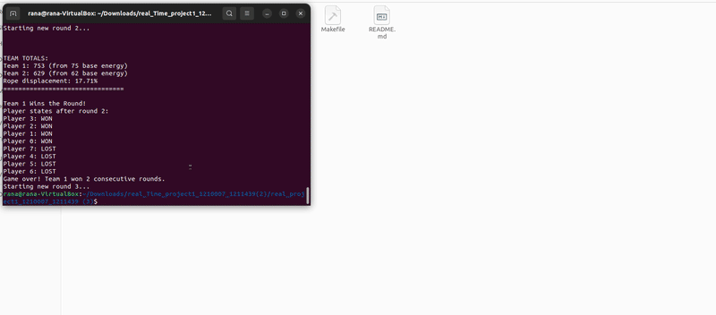

---

# 🧠 Tug of War Simulation 💪🏽🚩



Welcome to my Tug of War game simulation! 🎉 This C project brings a classic game to life with multi-processing, inter-process communication, and a visual twist using OpenGL! 🚀 The project uses multiple processes to simulate players and a referee, with pipes and signals handling communication and synchronization. OpenGL brings the action to life visually, making it a fun and interactive experience!

## 📂 Project Structure

The project is organized for clarity and modularity:
```plaintext
`Tug_of_war_simulation/`
├── `bin/` 🎯 Compiled executable lives here
├── `include/` 📁 Header files
│   ├── `gui.h` 🎨 OpenGL GUI interface
│   └── `config.h` ⚙️ Loads game configuration
├── `obj/` 🧱 Compiled object files
├── `src/` 💻 Source code
│   ├── `main.c` 🧑‍⚖️ Starts the game & handles referee logic
│   ├── `player.c` 🏋️ Player logic and actions
│   └── `config.c` 🛠️ Configuration file loader
├── `Makefile` 📦 Automates building & running
└── `README.md` 📘 This file!
```
## 🔗 Inter-Process Communication (IPC)

We use a combination of pipes and signals to keep the game synchronized and responsive.
📬 **Pipes** are used to transfer scores and status between the referee and the players.
⏱️ **Signals** are used to coordinate when players should act and when the referee should evaluate the game state.

## 🛠️ Build & Run Instructions

To build the project, run:

```bash
make  
```

To run the simulation:

```bash
make run  
```

To clean up object files and the executable:

```bash
make clean  
```

## 💡 Features

🎨 Real-time GUI using OpenGL for immersive visualization
🧑‍🤝‍🧑 Two teams competing simultaneously in a tug-of-war match
🔁 Synchronized gameplay rounds and live game state feedback
⚙️ Configurable game settings loaded from an external file for easy tweaking

## ✨ Have Fun Tugging!

Pull hard, play fair, and may the strongest team win! 💥💪 If you enjoyed the project, feel free to ⭐ star it and fork it on GitHub to make it your own!

---
